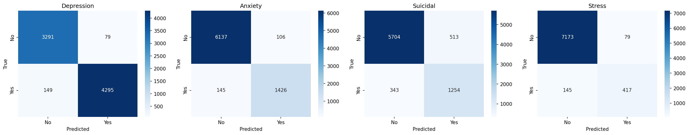
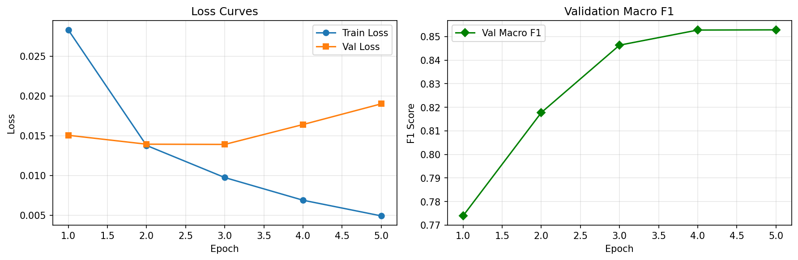

# 🧠 MindSignal — Mental Health Signal Detector

> Multi-label mental health signal detection from social media text using fine-tuned BERT, with severity scoring, explainability, and a production-ready API.

[](https://python.org)
[](https://pytorch.org)
[](https://huggingface.co)
[](LICENSE)
[](https://huggingface.co/spaces/Sagnik120/mindsignal)

**[🔗 Try the live demo](https://huggingface.co/spaces/Sagnik120/mindsignal)** · **[📦 Model weights](https://huggingface.co/Sagnik120/mindsignal-weights)** · **[👤 HuggingFace profile](https://huggingface.co/Sagnik120)**

---

## 🎯 Problem Statement

Millions of people express signs of mental health struggles on social media long before reaching out for help. Crisis helplines and content moderation teams have no automated way to triage this volume of text. MindSignal demonstrates how a fine-tuned transformer can flag posts for **Depression, Anxiety, Suicidal Ideation, and Stress simultaneously**, with calibrated severity levels and full explainability — built as a reference architecture for real-world deployment, not just a benchmark exercise.

---

## 🆕 What Makes This Different

| Capability | Typical NLP Classroom Project | MindSignal |
|---|---|---|
| Output | Single binary label | 4 independent multi-labels |
| Severity | None | None / Mild / Moderate / Severe |
| Imbalance handling | Ignored | Focal Loss + per-label thresholds |
| Explainability | None | SHAP token-level attribution |
| Decision calibration | Fixed 0.5 threshold | Lower threshold (0.35) for suicidal label — recall-prioritized by design |
| Serving | Notebook only | FastAPI REST API + Gradio demo + Docker |
| Deployment | Local only | Live on HuggingFace Spaces |

---

## 📊 Results

> Trained on 36,464 samples · Evaluated on 7,814 held-out test samples · Base model: `bert-base-uncased`, fine-tuned

| Label | Precision | Recall | F1 |
|---|---|---|---|
| Depression | 0.98 | 0.97 | **0.97** |
| Anxiety | 0.93 | 0.91 | **0.92** |
| Suicidal | 0.71 | 0.79 | **0.75** |
| Stress | 0.84 | 0.74 | **0.79** |
| **Macro avg** | | | **0.8568** |
| **AUC-ROC** | | | **0.9772** |
| **Hamming Loss** | | | **0.0499** |

> ⚡ **Suicidal recall = 0.79** — the model uses a lower decision threshold (0.35 instead of 0.5) for this label specifically, trading some false positives for fewer missed at-risk cases. This is a deliberate product decision, not an artifact of training.




---

## 🏗️ Architecture

```
Raw text
   │
   ▼
Text cleaning (lowercase, strip URLs/mentions, normalize whitespace)
   │
   ▼
BERT tokenizer (max_len=256)
   │
   ▼
bert-base-uncased (12 layers, 768 hidden, fine-tuned)
   │
   ▼
[CLS] token representation
   │
   ▼
Dropout(0.3) → Linear(768→256) → GELU → Dropout(0.15) → Linear(256→4)
   │
   ▼
Sigmoid (independent probabilities, NOT softmax)
   │
   ▼
Per-label thresholds → severity bucket (none/mild/moderate/severe)
```

**Loss function:** Focal Loss (α=0.25, γ=2.0) instead of plain BCE — down-weights easy examples and focuses gradient on the hard, minority-class cases (suicidal = 20.4% of data, stress = 7.0%).

---

## 📦 Dataset

**Source:** [Sentiment Analysis for Mental Health — Kaggle](https://www.kaggle.com/datasets/suchintikasarkar/sentiment-analysis-for-mental-health)

- 52,681 Reddit & Twitter posts, publicly available
- 7 original classes (Normal, Depression, Suicidal, Anxiety, Bipolar, Stress, Personality Disorder) remapped to 4 independent binary labels, allowing a single post to carry multiple signals (e.g. a Bipolar-labeled post maps to `depression=1, anxiety=1`)
- Stratified 70/15/15 train/val/test split on the rarest label (`suicidal`) to preserve class balance across splits

---

## 🏛️ Project Structure

```
mental-health-detector/
├── data/
│   ├── raw/                  # Original Kaggle CSV
│   └── processed/            # Cleaned, multi-label, split datasets
├── src/
│   ├── data/                 # Preprocessing, PyTorch Dataset
│   ├── models/                # Model architecture, device handling
│   ├── training/              # Trainer, Focal Loss
│   ├── evaluation/            # Metrics, confusion matrices, plots
│   ├── explainability/        # SHAP, attention extraction
│   └── api/                   # FastAPI app
├── deployment/
│   ├── docker/                 # Dockerfile + docker-compose
│   └── hf_spaces/              # Gradio demo (live on HF Spaces)
├── scripts/                    # download_data, preprocess, train, evaluate
├── tests/                      # Unit tests
├── configs/                    # YAML training config
└── outputs/                    # Checkpoints, metrics, plots
```

---

## ⚡ Quick Start

```bash
# Clone and enter
git clone https://github.com/Sagnik120/mental-health-detector.git
cd mental-health-detector

# Environment
python3.11 -m venv venv
source venv/bin/activate
pip install -r requirements.txt

# Data
cp .env.example .env   # add your Kaggle API key
python scripts/download_data.py
python scripts/preprocess.py

# Train (≈25-35 min on Apple Silicon MPS)
python scripts/train.py --config configs/train_config.yaml

# Evaluate
python scripts/evaluate.py --checkpoint outputs/checkpoints/best_model.pt

# Serve locally
uvicorn src.api.app:app --reload --port 8000
# → Swagger docs at http://localhost:8000/docs
```

Full setup walkthrough: [`SETUP_GUIDE.md`](SETUP_GUIDE.md)

---

## 🔌 API Usage

```bash
curl -X POST http://localhost:8000/predict \
  -H "Content-Type: application/json" \
  -d '{"text": "I have been crying every day for weeks and cannot get out of bed"}'
```

```json
{
  "predictions": [
    {"label": "depression", "probability": 0.78, "detected": true, "severity": "moderate"},
    {"label": "anxiety",    "probability": 0.05, "detected": false, "severity": "none"},
    {"label": "suicidal",   "probability": 0.10, "detected": false, "severity": "none"},
    {"label": "stress",     "probability": 0.03, "detected": false, "severity": "none"}
  ]
}
```

---

## 🐳 Docker Deployment

```bash
cd deployment/docker
docker-compose up --build
```

---

## 🧪 Production Engineering Notes

A few real bugs hit and fixed during development, kept here intentionally because they're the kind of thing interviewers ask about:

- **Train/inference skew:** the API initially served raw, uncleaned text to a model trained on lowercased, regex-cleaned text — silently degrading every prediction. Fixed by sharing the exact `clean_text` function between training and serving.
- **Checkpoint portability:** the architecture name wasn't saved inside the checkpoint, so loading a `bert-base-uncased` checkpoint with a different config string would silently reinitialize the wrong backbone. Fixed by persisting `model_name` inside the checkpoint itself.
- **Path resolution under different launch contexts:** relative checkpoint paths resolved differently depending on whether the API was launched via `uvicorn` from the repo root vs. elsewhere. Fixed with `Path(__file__).resolve().parent.parent.parent`.

---

## ⚠️ Ethical Statement

This project is for **research and educational purposes only**. Model outputs are not clinical diagnoses and must never be treated as one. If you or someone you know is in crisis, please contact a licensed mental health professional or a local crisis helpline.

---

## 👤 Author

**Sagnik Chandra**
[GitHub @Sagnik120](https://github.com/Sagnik120) · [HuggingFace @Sagnik120](https://huggingface.co/Sagnik120) · [Kaggle @sagnikchandra027](https://kaggle.com/sagnikchandra027)